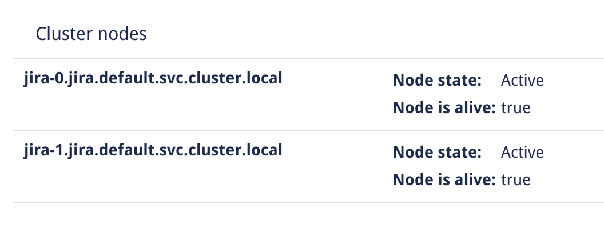

# Rook ASK demo

## Introduction
This repo is used to demo Rook.io and ASK at Code-Conf 2019. The code here will not be maintained when Code-Conf has passed.

## Prerequsits
You need to have a Kubernetes cluster up and running, and helm installed. The code in this repo has been tested on Kubernetes version 1.15.2 with the feature gate ```VolumeSnapshotDataSource=true``` turned on. The cluster used is spun up using Rancher RKE. The ```/rke/cluster.yaml``` file used to create the 4 node cluster can be found in this repo as well. 

Getting Helm up and running is out of scope of this guide. But we expect it to be installed and running. A quick script for getting Helm installed can be found at ```/helm/install-helm.sh```.

In order to use Praqma ASK docker images from the Docker hub, you need to have a secret with credentials named ```docker-hub-credentials``` as the repo is private. the name can be changed in the ```/ask/values.yaml```. The script ```/ask/create-hub-secret.sh``` helps you to create this secret. 

Some kind of ingress controller is needed. If you dont have one, you can use kubectl port-forward ```kubectl port-forward jira-0 8000:8080```. If you want to use an Ingress, we created a helmsman file ```/traefik/traefik-helmsman.yaml``` that can be deployed via ```/traefik/deploy-traefik.sh```. The service of Traefik will be of type LoadBalancer and exposed via MetalLB, which is deployed in the same Helmsman file.

## Rook setup

### Deploying the Rook operator
First off we will deploy a ```common.yaml``` that creates a namespace for Rook, Custom Resource Definitions, and Cluster Roles and Role Bindings among other things used by the Rook Operator. Then we deploy ```operator.yaml``` that creates the operator it self. These two deployments are done by the ```/rook/install-rook.sh``` script.

Use ```kubectl get pods -n rook-ceph``` command to see when Rook is ready before continouing. 

### Creating a Ceph cluster

When the Rook Operator is deployed and ready we can create our Ceph cluster. The Rook team have a ```cluster-test.yaml``` we can use for quick test purposes. The script ```/rook/create-ceph-test-cluster.sh``` can be used to deploy it.

Again, use ```kubectl get pods -n rook-ceph``` command to see when the Ceph pods are ready before continouing. 

### Creating file systems
For both the block and shared filesystem we need to create a storage pool in our Ceph cluster.

The script ```rook/create-blockpool.sh``` create a blockpool for the RWO volumes and ```rook/create-cephfilesystem.sh``` create the filesystem for the shared filsystem used by our RWX volume.

### Creating storageClasses

We need to create a storageclass for both our volumes. One being a Block Storage and the other a Shared file system. The files ```/rook/storageclass-block.yaml``` and ```/rook/storageclass-cephfs.yaml``` contains the storageclass definition and are both deployed via ```/rook/create-storage-classes.sh```

Confirm that the two storageclasses are created
```
kubectl get storageclasses
NAME              PROVISIONER                     AGE
rook-ceph-block   rook-ceph.rbd.csi.ceph.com      4s
rook-cephfs       rook-ceph.cephfs.csi.ceph.com   4s
```

## Postgres setup
### Deploying Postgresql
Postgres is needed by Jira to work, so we have a small script ```/postgres/deploy-postgres.sh``` that deploys a suported version using the Block storage from Rook we created above. 

## Jira setup
### Deploying Jira Data Center
If you want to use Praqma Docker images for ASK, you need to create a secret used to pull the images, named ```docker-hub-credentials```. You can use the script ```create-hub-secret.sh```. 

Edit the file values.yaml to you needs, and then deploy Jira Data Center with the script ```/ask/deploy-jira.sh```.

Now, a pod should be created with the name ```jira-0```.

### Configure Jira
Open a browser and go to ```http://jira.192.168.122.214.nip.io``` and click on ```I'll set it up myself```, and then next.

Choose ```My Own Database```, select ```PostgreSQL``` as database type. Hostname for postgres should be ```postgres-jira-postgresql.default.svc.cluster.local```, Database should be ```jira```, Username should be ```jirauser``` and password is ```jira_password``` as defined in ```/postgres/deploy-postgres.sh``` we ran earlier.

```
Hostname : postgres-jira-postgresql.default.svc.cluster.local
Database : jira
Username : jirauser
Password : jira_password
```


Click ```Test Connection``` and you should get the message :
> The database connection test was successful.

Now click ```Next```.

Becaurse Jira stops answering on ```/status``` while setting up the database, it might get not-ready, and the ingress will stop sending traefik. Wait until the Ready state of jira-0 is 1/1 again, then press F5 in the browser. Or, use a portforward to jira-0 and setup jira that way. 

Put the settings you want under Application properties like the ```Application Title```, ```Mode``` and ```BaseUrl```. ```BaseUrl``` should be the same as the Ingress value in ```/ask/values.yaml```. Click next.

Next, insert a license and click ```Next```.

Again, Jira might stop answering on ```/status``` so have patianse and reload if the browser goes dead.

Next, insert your ```Full name```, ```Email```, ```Username``` and ```Password``` and then click ```Next```.

We dont want to configure an mail server, so keep the ```Later``` option and click ```Finish```.

Choose a language of your preference, and click ```Continue```.

Choose an avatar image and click ```Next```.

Now, click ```Create new project```, choose a template (eg. Kanban) and click next, Select, give it a name and click Submit.

Now Jira is setup. Click the gearknob in the top right corner, and click System. Then click ```System Info```. Search for ```Cluster nodes``` to see that we have a node called ```jira-0.jira.default.svc.cluster.local``` that is Active and alive.

Now we are ready to scale Jira !

### Creating a snapshot of Jira home
In order to create snapshots, we need to create a snapshotclass. 
In the folder ```/snapshot/``` you will find a ```snapshotclass.yaml```. This will create a snapshot.class to use with the Ceph cluster.

There is also a ```snapshot.yaml``` that will create a snapshot of PVC ```jira-persistent-storage-jira-0```. And finally ```restore-snapshot.yaml``` that will create a new PVC named ```jira-persistent-storage-jira-1``` based on the snapshot we created. Run the script ```create-snapshot.sh``` to apply all three objects.

### Scale Jira
Now we have a PVC ready for ```jira-1``` to use. So we can simply scale the statefulset that Jira is, by running ```kubectl scale statefulset jira --replicas=2```

Go to Jira System -> System Information and search for ```Cluster nodes``` again. There should now be two active nodes. (Or refresh the page if you're still there).



And in the footer, we can verify that we are in fact running Jira 8.4.0, and logged in on node Jira-0.

```
Atlassian Jira Project Management Software (v8.4.0#804001-sha1:a071452:jira-0.jira.default.svc.cluster.local)
```

You should end up with the following files inside the containers, in the homefolder:
```
> kubectl exec -it jira-0 -- ls -l /var/atlassian/application-data/jira/
total 12
drwxr-s---. 4 jira jira   46 Sep 12 14:51 caches
-rw-r--r--. 1 jira jira  617 Sep 12 14:49 cluster.properties
-rw-r-----. 1 jira jira 1094 Sep 12 14:50 dbconfig.xml
drwxr-s---. 2 jira jira 4096 Sep 12 15:10 localq
drwxr-s---. 2 jira jira  131 Sep 12 14:52 log
drwxr-s---. 2 jira jira   76 Sep 12 14:52 monitor
drwxr-s---. 6 jira jira  100 Sep 12 14:51 plugins
drwxr-s---. 3 jira jira   26 Sep 12 14:49 tmp

> kubectl exec -it jira-1 -- ls -l /var/atlassian/application-data/jira/
total 12
drwxrws---. 4 jira jira   46 Sep 11 15:47 caches
-rw-rw-r--. 1 jira jira  617 Sep 12 15:10 cluster.properties
-rw-rw----. 1 jira jira 1094 Sep 11 15:47 dbconfig.xml
drwxr-s---. 2 jira jira 4096 Sep 12 15:10 localq
drwxrws---. 2 jira jira  131 Sep 12 15:11 log
drwxrws---. 2 jira jira   76 Sep 11 15:49 monitor
drwxrws---. 6 jira jira  100 Sep 11 15:48 plugins
drwxrws---. 3 jira jira   26 Sep 11 15:46 tmp

```

The date on the file ```cluster.properties``` should vary as it is modified by our container startup script.

The following Pods should be running
```
kubectl get pods
NAME                                        READY   STATUS    RESTARTS   AGE
jira-0                                      1/1     Running   0          22m
jira-1                                      1/1     Running   0          2m9s
postgres-jira-postgresql-6d8f8cf8b5-qc46d   1/1     Running   0          23m
```

You should have the following PV's
```
kubectl get pv
NAME                                       CAPACITY   ACCESS MODES   RECLAIM POLICY   STATUS   CLAIM                                    STORAGECLASS      REASON   AGE
pvc-7e8d002a-f6a8-4e4b-8b12-5f6f628c0a15   5Gi        RWO            Delete           Bound    default/jira-persistent-storage-jira-0   rook-ceph-block            21m
pvc-8b6b58b4-7e08-464f-a3b2-46468fa83eb8   8Gi        RWO            Delete           Bound    default/postgres-jira-postgresql         rook-ceph-block            21m
pvc-df08a37e-05d6-465a-b559-225fb60c84a0   5Gi        RWO            Delete           Bound    default/jira-persistent-storage-jira-1   rook-ceph-block            6m4s
pvc-ff685a9e-df9a-4eda-b9ad-19e1b213246c   5Gi        RWX            Delete           Bound    default/jira-datacenter-pvc              rook-cephfs                21m
```

And PVC's:
```
kubectl get pvc
NAME                             STATUS   VOLUME                                     CAPACITY   ACCESS MODES   STORAGECLASS      AGE
jira-datacenter-pvc              Bound    pvc-ff685a9e-df9a-4eda-b9ad-19e1b213246c   5Gi        RWX            rook-cephfs       22m
jira-persistent-storage-jira-0   Bound    pvc-7e8d002a-f6a8-4e4b-8b12-5f6f628c0a15   5Gi        RWO            rook-ceph-block   22m
jira-persistent-storage-jira-1   Bound    pvc-df08a37e-05d6-465a-b559-225fb60c84a0   5Gi        RWO            rook-ceph-block   7m22s
postgres-jira-postgresql         Bound    pvc-8b6b58b4-7e08-464f-a3b2-46468fa83eb8   8Gi        RWO            rook-ceph-block   22m
```
